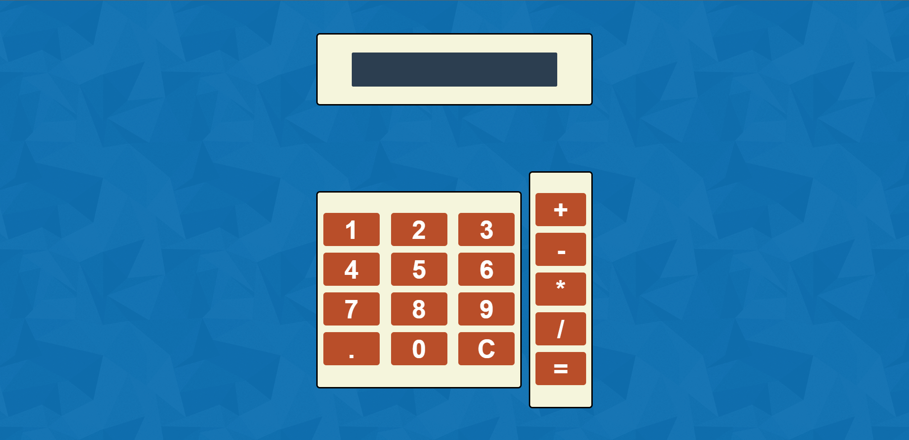

# Calculadora en React con Tailwind CSS

Este proyecto es una simple calculadora que permite realizar operaciones básicas como suma, resta, multiplicación y división sobre números decimales. Se desarrolló como un miniproyecto y repaso de React combinado con Tailwind CSS para el diseño.



## 🌟 Características

- Operaciones básicas: suma, resta, multiplicación y división.
- Soporte para números decimales.
- Diseño responsivo con Tailwind CSS.

## 🛠️ Tecnologías utilizadas

- [React](https://reactjs.org/)
- [Tailwind CSS](https://tailwindcss.com/)
- [Fondo de asfar mohamed](https://codepen.io/asfarmed)

## 🚀 Cómo ejecutar el proyecto

1. **Clonar el repositorio**

   ```bash
   git clone [URL-del-repositorio]
   cd [nombre-del-repositorio]
